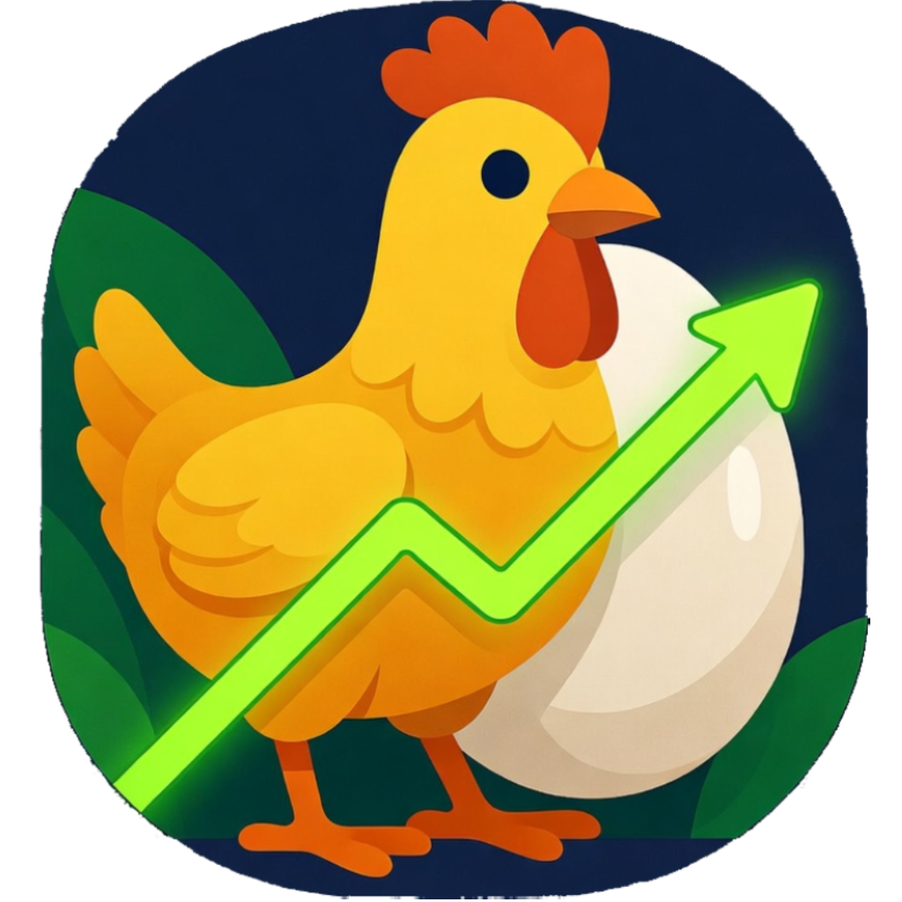

# 🐔 Chicken Tracker

<p align="center">
  
</p>

[](https://creativecommons.org/licenses/by-nc/4.0/)

**Version 1.2.2** — Offline-first egg production & flock management for homesteaders

Built for backyard farmers and small flock owners who want a simple, powerful way to track their chickens and eggs — no internet required.

---

## 📲 Install on Android

1. Download **[chicken-tracker-v1.2.2.apk](https://github.com/colaborat0r/chicken_tracker/releases/download/v1.2.2/chicken-tracker-v1.2.2.apk)** from the latest release
2. On your Android device, go to **Settings → Apps → Special app access → Install unknown apps**
3. Allow installs from your browser or file manager
4. Open the downloaded `.apk` file and tap **Install**
5. Launch **Chicken Tracker** from your home screen

> **Note:** Android may show a warning because the app is not from the Play Store — this is normal for sideloaded apps. The app is open-source and safe to install.

All releases are available on the [Releases page](https://github.com/colaborat0r/chicken_tracker/releases).

---

## ✨ Features

| Category | What you can do |
|---|---|
| 🥚 **Daily Logging** | Log egg counts by total or per hen, with color breakdown (brown / white / colored) |
| 🐔 **Flock Management** | Track breeds, hatch dates, age, status, and notes for every bird |
| 💰 **Sales Tracking** | Record egg and chicken sales with customer info and revenue summaries |
| 💸 **Expense Tracking** | Log feed, supplies, vet costs and other expenses by category |
| 🛒 **Flock Purchases** | Track chick and hatching egg purchases, suppliers, and hatch rates |
| ⚠️ **Flock Losses** | Record losses by type (predator, illness, etc.) |
| 📊 **Charts & Analytics** | Production trends, sales vs. expenses, yearly and monthly views |
| 📄 **Farm Report Card** | One-page branded PDF snapshot of your farm — shareable monthly summary |
| 📤 **Reports & Exports** | Export Production, Sales, Expenses, Purchases, and Losses as styled PDF or CSV |
| 🔔 **Reminders** | Notifications for feeding, cleaning, and health check schedules |
| 🌙 **Dark Mode** | Dark-first UI designed for barn and field use |
| ✈️ **Fully Offline** | All data stored locally on-device — no account or internet needed |

---

## 📄 PDF Exports

All PDF reports (Farm Report Card and the five data reports) share a consistent branded style:
- Farm banner header image with your farm name and report title
- Summary stat cards with key metrics
- Styled tables with brown headers and alternating row shading
- Matching warm cream footer

The farm name on reports defaults to **Chicken Tracker** and can be customized from the Home screen.

---

## 🛠️ Build from source

**Requirements:** Flutter 3.24+, Android SDK

```bash
git clone https://github.com/colaborat0r/chicken_tracker.git
cd chicken_tracker
flutter pub get
flutter run                        # debug run
flutter build apk --release        # build release APK
```

After any database schema change, regenerate the Drift code:

```bash
flutter pub run build_runner build --delete-conflicting-outputs
```

---

## 💬 Feedback & Support

Found a bug or have a feature idea? Open an [issue](https://github.com/colaborat0r/chicken_tracker/issues) or email: **thehost22000@yahoo.com**

---

## 📜 Changelog

See [Releases](https://github.com/colaborat0r/chicken_tracker/releases) for the full changelog.

| Version | Highlights |
|---|---|
| **1.2.2** | Reports & Exports PDFs match Farm Report Card branding; farm name on all PDF banners |
| **1.2.1** | Stability improvements, Android crash fixes |
| **1.2.0** | Farm Report Card PDF with photos; optional metrics; farm name customization |
| **1.0.0** | Initial release |

---

## 📄 License

This project is licensed under the **Creative Commons Attribution-NonCommercial 4.0 International** license.

- ✅ Free to use, share, and adapt for personal/non-commercial use
- ✅ Must give credit to the original project
- ❌ Cannot be used for commercial purposes

See the [LICENSE](LICENSE) file or [creativecommons.org/licenses/by-nc/4.0](https://creativecommons.org/licenses/by-nc/4.0/) for full details.

